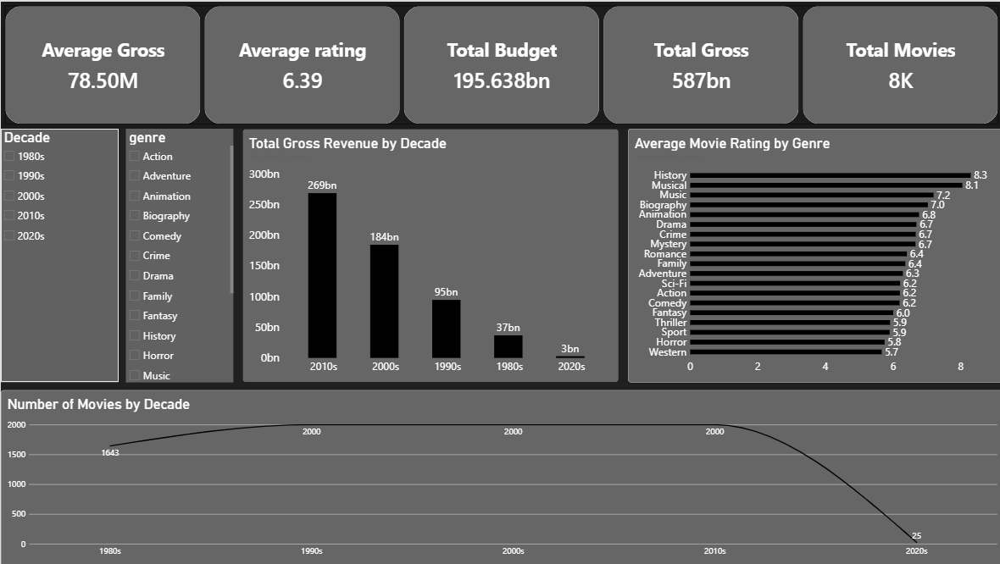
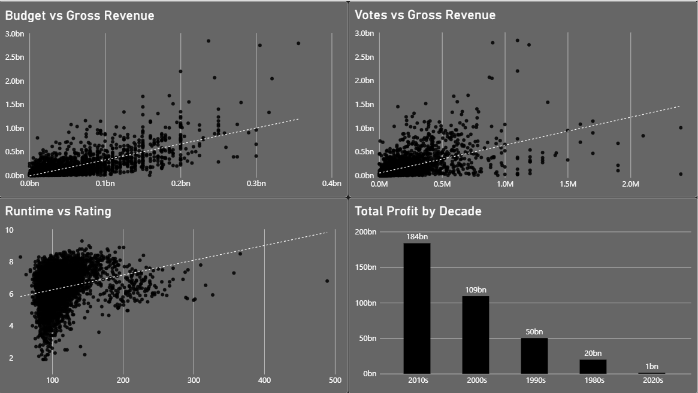

# 🎬 Movie Analytics & Performance Dashboard

## 📊 Overview

This project is an interactive Movie Analytics Dashboard built using Microsoft Power BI.

The dashboard analyzes movie performance across revenue, budget, ratings, votes, runtime, genres, and release decades.

The goal of the project is to transform raw movie data into an interactive analytical report that allows users to explore trends and relationships within the movie industry.

---

## 🎯 Project Objectives

- Analyze overall movie performance
- Explore revenue trends across decades
- Compare average ratings between genres
- Analyze the relationship between budget and gross revenue
- Analyze the relationship between votes and gross revenue
- Explore runtime and rating patterns
- Analyze total profit across decades

---

## 📄 Dashboard Pages

### Page 1 — Movie Overview

Provides a high-level overview of the dataset.

#### KPIs
- Average Gross
- Average Rating
- Total Budget
- Total Gross
- Total Movies

#### Visualizations
- Total Gross Revenue by Decade
- Average Movie Rating by Genre
- Number of Movies by Decade
- Decade Slicer
- Genre Slicer

---

### Page 2 — Movie Performance

Focuses on relationships between movie performance metrics.

#### Visualizations

- Budget vs Gross Revenue
- Votes vs Gross Revenue
- Runtime vs Rating
- Total Profit by Decade

Trend lines are included in the scatter plots to help visualize the overall direction of the relationships.

---

## 🛠️ Tools Used

- Microsoft Power BI
- Power Query
- DAX
- Data Visualization
- Exploratory Data Analysis

---

## 🧠 Skills Demonstrated

- Data Cleaning
- Data Transformation
- DAX Measures
- Calculated Columns
- KPI Development
- Interactive Dashboard Design
- Data Analysis
- Trend Analysis
- Data Visualization
- Business Intelligence

---

## 🔍 Key Insights

The dashboard provides several analytical observations:

- Movie gross revenue varies considerably across decades.
- Movie genres have different average rating levels.
- Movie budget and gross revenue show an observable relationship.
- Audience votes can be explored in relation to movie revenue.
- Runtime and movie rating do not follow a simple linear pattern.
- Total profit varies significantly across release decades.

---

## 📷 Dashboard Preview

### Movie Overview

### Movie Performance

---

## 🚀 Project Purpose

This project was created as a Data Analytics / Business Intelligence portfolio project to demonstrate practical Power BI skills and the ability to transform raw data into an interactive analytical dashboard.